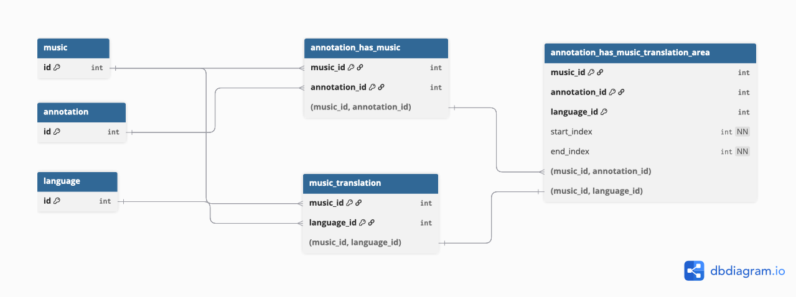

# Database

## Prerequisites 
* Installed dbms (mysql or mariadb)
* A database 'FIPOP' with collation set to 'utf8mb4_general_ci'

## Installation
* Create a database 'FIPOP' and make sure the collation is set to 'utf8mb4_general_ci'
* To install the database schema execute the sql-file [fipop.sql](../src/main/resources/database/fipop.sql)
* The default application username and password are admin/admin

## Update
* Create a dump of the current database as backup
* Execute the sql-file [db_update.sql](../src/main/resources/database/db_update.sql) 

## Versioning
The current version of the database schemas can be read from the `db_version` table. This table has existed since TIMAAT version >= 0.14.x.
The versioning of the database schema follows the following pattern:

* Major version is the same as TIMAAT major version
* Minor version is the same as TIMAAT minor version
* Patch version is incremented after each update of the database schema for the same TIMAAT major and minor version

## Releases

### 0.14.0

* Added table `db_version` to persist the current database schema version
* Added tables `audio_analysis`, `medium_audio_analysis`, `audio_analysis_state`, `audio_analysis_state_translation` which are used to persist the state and results of async audio analysis tasks
  

### 0.14.1

* Added table `music_translation` responsible to persist the lyrics or spoken text of music entries

### 0.14.2

* Added table `annotation_has_music` to persist reference between music and annotation
* Added table `annotation_has_music_translation_area` to persist the hearable transcription range
